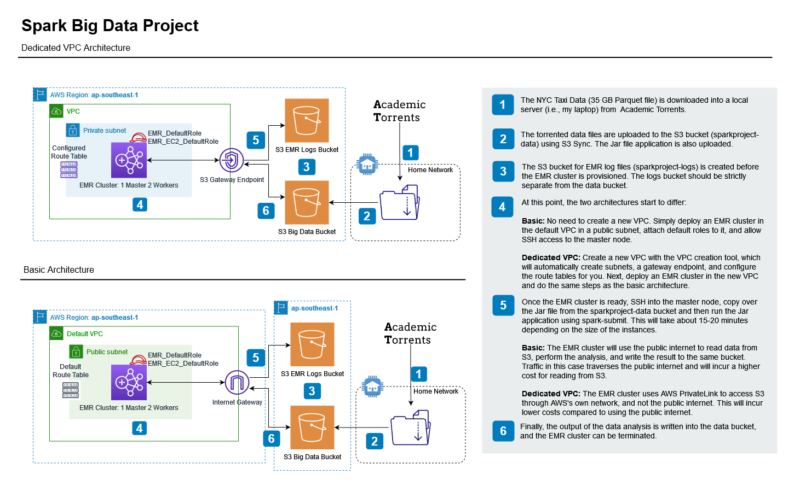

# Big Data Project with Spark

```bash
.
├── project
│   └── build.properties
├── spark-cluster
│   ├── apps
│   │   └── spark-big-data.jar
│   ├── build-images.sh
│   ├── data
│   │   └── movies.json
│   ├── docker
│   │   ├── base
│   │   │   └── Dockerfile
│   │   ├── spark-master
│   │   │   ├── Dockerfile
│   │   │   └── start-master.sh
│   │   ├── spark-submit
│   │   │   ├── Dockerfile
│   │   │   └── spark-submit.sh
│   │   └── spark-worker
│   │       ├── Dockerfile
│   │       └── start-worker.sh
│   ├── docker-compose.yml
│   └── env
│       └── spark-worker.sh
├── sql
│   └── db.sql
├── src
|   ├── META-INF
|   │   └── MANIFEST.MF
|   └── main
|       ├── resources
|       │   ├── data
|       │   │   └── manyDataFilesHere
|       │   └── warehouse
|       │       └── rtjvm.db
|       │           └── moreDataFilesHere
|       └── scala
|           ├── sparkbigdataproject
|           │   ├── TaxiApplication.scala
|           │   └── TaxiEconomicImpact.scala
|           ├── sparkdataframes
|           │   ├── Aggregations.scala
|           │   ├── AggregationsExercises.scala
|           │   ├── ColsAndExprsExercises.scala
|           │   ├── ColumnsAndExpressions.scala
|           │   ├── DFExercises.scala
|           │   ├── DataFramesBasics.scala
|           │   ├── DataSources.scala
|           │   ├── DataSourcesExercises.scala
|           │   ├── Joins.scala
|           │   └── JoinsExercises.scala
|           ├── sparkjardeployment
|           │   └── TestDeployApp.scala
|           ├── sparklowlevel
|           │   ├── RDDExercises.scala
|           │   ├── RDDs.scala
|           │   └── WorkingWithRDDs.scala
|           ├── sparksql
|           │   └── SparkSql.scala
|           └── sparktypesanddatasets
|               ├── CommonTypes.scala
|               ├── CommonTypesExercises.scala
|               ├── ComplexTypes.scala
|               ├── ComplexTypesExercises.scala
|               ├── Datasets.scala
|               ├── DatasetsExercises.scala
|               └── ManagingNulls.scala
├── .gitignore
├── build.sbt
├── docker-clean.sh
├── docker-compose.yml
├── psql.sh
└── README.md
```

In the final chapter of this project, I processed 35 GB of NYC Taxi Rides data, from 2009 to 2016, in compressed Parquet format (~400 GB when deflated into CSV, according to RockTheJVM's [Spark Essentials](https://rockthejvm.com/p/spark-essentials) course). I downloaded it from [Academic Torrents](https://academictorrents.com/) and uploaded the files into an S3 bucket created as `sparkproject-data`. Afterwards, I created an EMR cluster, which was given default roles (additionally, also for the associated EC2 instances) to read data from the S3 bucket, and then write the output and logs into the `sparkproject-data` and `sparkproject-logs` buckets, respectively. The Jar file for the project was uploaded to S3, copied into the master node and executed locally on the cluster after SSHing into the master node.

To reduce costs, it should be possible to set up the EMR cluster within a dedicated VPC with a Gateway Endpoint for directing traffic to S3 via AWS's own network, and not through the public internet. However, the data transfer is small enough that the reduction in cost is not significant, since most of the cost is incurred by EC2 and EMR compute costs, at about 92% of $1.05 for this project.

Two possible architectures for this project are shown below. Since this is a single batch operation that can be resumed/restarted at any desired time, high-availability of the architecture is not a strict requirement.



Apart from a few changes in the `docker-compose.yml` file for the local Postgres database, the Spark cluster setup is the same as in the Spark Essentials GitHub page. Also ensure that the Spark version (v3.2.1) for the packaged Jar file is the same as the Spark version (v3.2.1) that the EMR cluster is going to be bootstrapped with (in case any `NoSuchMethodError`s pop up, either locally or on the EMR cluster).
